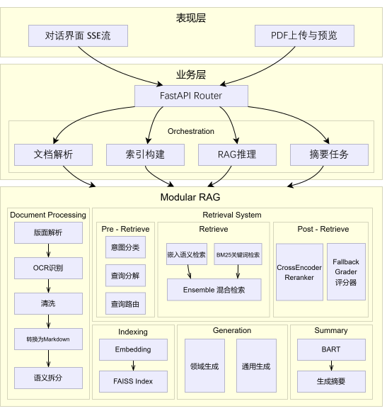
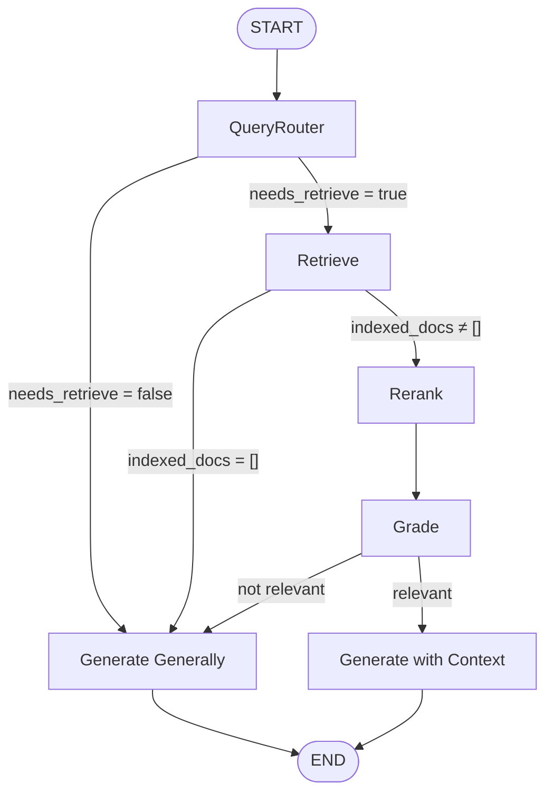

<div align="center">


# OpenLit

**多模态 PDF 学术文献智能问答系统 — LangGraph 实现的 Modular RAG**

上传学术文献，一键解析、检索、问答，获得带引用的精准回答。

[](https://arxiv.org/abs/2312.10997v1)
[](https://fastapi.tiangolo.com)
[](https://www.langchain.com)
[](https://react.dev)

<br/>

[](https://github.com/AnKuweii/OpenLit/stargazers)
[](https://github.com/AnKuweii/OpenLit/network)
[](LICENSE)

</div>

---

## 📖 简介

OpenLit（取自 Open Literature 的缩写） 是一个**Multimodal Modular RAG 系统**，专为学术文献场景设计。用户上传 PDF 后，系统自动完成 OCR 解析、语义拆分、向量索引，并通过 LangGraph 状态机驱动的智能问答管线，提供**带文档引用的流式回答**。

---

## 🎯 主要特性

- 📄 **PDF 全流程处理** — 上传 → OCR 解析 → 布局可视化 → Markdown 转换
- 🔍 **三级检索优化** — 检索前路由 / 检索时混合召回 / 检索后重排+评分
- 🧠 **LangGraph 状态机** — 为复杂系统提供可控性的运行时支持
- 📡 **查询路由** — 条件路由自动选择"有上下文"或"通识"生成路径
- 🔗 **混合检索** — BM25 关键词检索 + FAISS 向量检索融合
- 🏆 **CrossEncoder 重排序** — `BAAI/bge-reranker-v2-m3` 精细排序
- 📊 **BART 文档摘要** — `facebook/bart-large-cnn` 一键生成文档概要
- 🖼️ **多模态图片引用** — 自动提取 PDF 内嵌图片并在回答中内联展示
- 🌊 **SSE 流式推送** — Token 级实时流 + Citation 引用事件 + 解析进度流
- 💬 **多轮对话记忆** — LangGraph MemorySaver 检查点持久化上下文
- 🀄 **中英双语 OCR** — PaddleOCR 引擎，原生支持中文学术文献

---

## 🏗️ 架构设计

**系统架构：**
<div align="center">


</div>

**LangGraph 状态图：**

<div align="center">


</div>

---

## 🚀 快速开始

### 环境要求

| 依赖            | 最低版本                                     |
| -----------     | --------------------------------------------|
| Python          | 3.11+                                       |
| Node.js         | 18+                                         |
| uv              | 0.10.9                                      |
| GPU (Optional)  | CUDA 12.0+，显著加速嵌入 / 重排序 / 摘要推理  |

### 1. 克隆仓库

```bash
git clone https://github.com/AnKuweii/OpenLit.git
cd ./OpenLit
```

### 2. 后端配置与启动
Step 1. 安装依赖：
```bash
cd backend
uv pip install -r requirements.txt
```

Step 2. 创建 `.env` 文件并填入必要配置：

```properties
# LLM 配置
OPENAI_BASE_URL=https://api.openai.com/v1
OPENAI_API_KEY=sk-xxxxxxxxxxxxxxxx
MODEL_NAME=gpt-4o-mini
MODEL_PROVIDER=openai
TEMPERATURE=0.7

# 重排序和摘要模型 (Customizable)
RERANKER_MODEL=BAAI/bge-reranker-v2-m3
SUMMARY_MODEL=facebook/bart-large-cnn
```

Step 3. 启动后端服务：

```bash
uvicorn app:app --host 0.0.0.0 --port 8001 --reload
```

> 💡 首次启动会自动下载 BGE-M3 嵌入模型、Reranker 模型和 BART 摘要模型（共约 3–5 GB），请确保网络畅通。

### 3. 前端配置与启动

```bash
cd frontend
npm install
npm run dev
```


打开浏览器访问 `http://localhost:3000` 即可。

---

## 📁 项目结构

```
OpenLit/
├── README.md
├── .gitignore
├── LICENSE
│
├── assets/
│   └── overall.svg               # 架构图
│
├── backend/
│   ├── app.py                    # FastAPI 入口 & 路由注册
│   ├── config.py                 # 配置中心（模型/提示词/阈值/环境变量）
│   ├── schema.py                 # Pydantic 请求模型
│   ├── state.py                  # 进程内共享状态
│   ├── utils.py                  # 通用工具函数
│   ├── openapi.yaml              # OpenAPI 3.1 规范文档
│   ├── requirements.txt          # Python 依赖
│   ├── .env                      # 环境变量（不提交）
│   │
│   ├── model/
│   │   └── __init__.py           # ModelFactory 单例工厂
│   │
│   ├── graph/
│   │   ├── state.py              # GraphState 类型定义
│   │   ├── nodes.py              # 6 个 LangGraph 节点
│   │   └── graph_builder.py      # 状态图构建 & 编译
│   │
│   ├── router/
│   │   ├── pdf.py                # PDF 管理路由
│   │   └── chat.py               # 对话 SSE 流式路由
│   │
│   ├── services/
│   │   ├── pdf_service.py        # PDF 解析 & 渲染 & Markdown 转换
│   │   ├── index_service.py      # 分块 & FAISS 索引
│   │   ├── retrieve_service.py   # 混合检索 & 引用构建
│   │   ├── rerank_service.py     # CrossEncoder 重排序
│   │   └── summary_service.py    # BART 摘要生成
│   │
│   └── data/                     # 运行时数据（PDF/图片/索引）
│
└── frontend/
    ├── index.html
    ├── package.json
    ├── vite.config.ts
    │
    └── src/
        ├── App.tsx               # 根组件
        ├── main.tsx              # 入口文件
        ├── services/
        │   └── api.ts            # API 服务层（全部后端调用）
        ├── components/
        │   ├── Header.tsx        # 顶部导航
        │   ├── ChatInterface.tsx # 对话界面（SSE 流式）
        │   ├── PDFPanel.tsx      # PDF 面板（上传/预览/摘要）
        │   ├── MarkdownRenderer.tsx  # Markdown 渲染器
        │   ├── HealthCheck.tsx   # 后端连通性检测
        │   ├── ParticleCanvas.tsx# 粒子动效背景
        │   └── ui/               # Radix UI 组件库（40+ 组件）
        └── styles/
            └── globals.css       # 全局样式 & 动效
```
<details>
<summary>📋 完整 API 端点列表</summary>

| 方法   | 端点                        | 说明                              |
| ------ | --------------------------- | --------------------------------- |
| `GET`  | `/api/v1/health`            | 健康检查                          |
| `POST` | `/api/v1/pdf/upload`        | 上传 PDF                          |
| `POST` | `/api/v1/pdf/parse`         | 触发异步解析                      |
| `GET`  | `/api/v1/pdf/status`        | 查询解析状态                      |
| `GET`  | `/api/v1/pdf/status/stream` | SSE 订阅解析进度                  |
| `GET`  | `/api/v1/pdf/page`          | 获取页面图片（original / parsed） |
| `GET`  | `/api/v1/pdf/images`        | 获取 PDF 内嵌图片                 |
| `GET`  | `/api/v1/pdf/chunk`         | 获取引用片段详情                  |
| `POST` | `/api/v1/pdf/summary`       | 生成文档摘要                      |
| `POST` | `/api/v1/index/build`       | 构建 FAISS 向量索引               |
| `POST` | `/api/v1/index/search`      | 相似度检索（Top-K）               |
| `POST` | `/api/v1/chat`              | RAG 对话（SSE 流式）              |
| `POST` | `/api/v1/chat/clear`        | 清空会话历史                      |

</details>

---

## 🤝 贡献指南

欢迎提交 Issue 和 Pull Request！

1. **Fork** 本仓库
2. 创建特性分支：`git checkout -b feature/amazing-feature`
3. 提交更改：`git commit -m "feat: add amazing feature"`
4. 推送分支：`git push origin feature/amazing-feature`
5. 提交 **Pull Request**

**开发约定：**

- 后端遵循 [PEP 8](https://peps.python.org/pep-0008/) 风格
- 前端使用 TypeScript 严格模式
- Commit 信息遵循 [Conventional Commits](https://www.conventionalcommits.org/) 规范
- PR 请附带简要描述和测试说明

---

## 📄 许可证

本项目基于 [MIT License](LICENSE) 开源。

---

<div align="center">


**如果这个项目对你有帮助，欢迎点个 ⭐ Star！**

</div>
